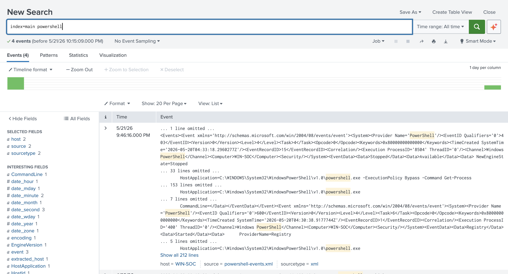
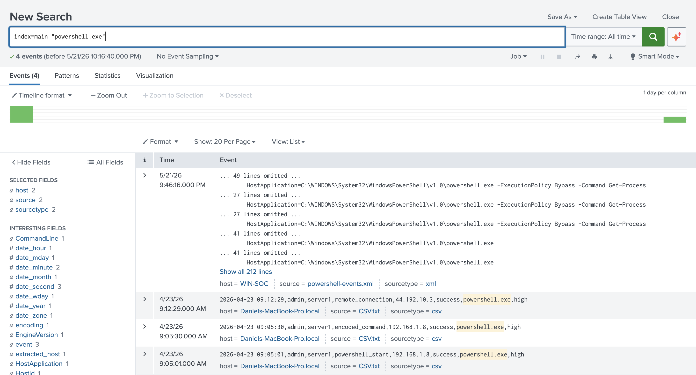
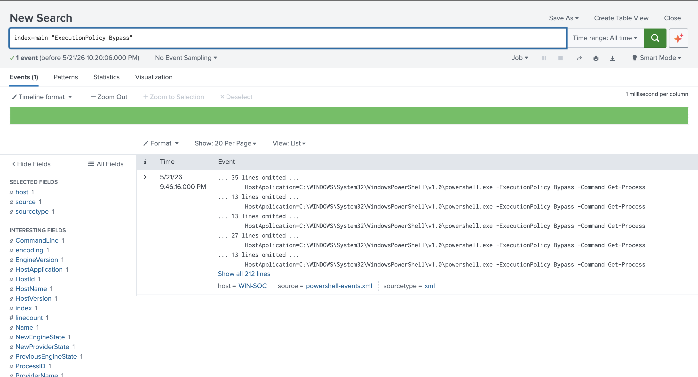

# PowerShell Security Automation Lab

## Overview
This project demonstrates how PowerShell can be used to collect Windows security and system information for SOC-style investigation workflows. The lab focuses on automating the collection of PowerShell activity, running services, network connections, and system inventory data from a Windows endpoint.

## Lab Environment
- Windows 11 virtual machine
- PowerShell
- Windows Event Viewer
- Splunk Enterprise
- GitHub

## Project Structure

```text
PowerShell-Security-Automation-Lab/
├── scripts/
├── outputs/
├── screenshots/
├── notes/
└── README.md
```

## Splunk Detection Analysis

After collecting PowerShell event data from the Windows endpoint, I uploaded the logs into Splunk and searched for suspicious PowerShell activity.

### Searches Performed

```spl
index=main powershell
```

```spl
index=main "powershell.exe"
```

```spl
index=main "ExecutionPolicy Bypass"
```

### Key Finding

Splunk identified PowerShell activity from host `WIN-SOC` using the command:

```text
powershell.exe -ExecutionPolicy Bypass -Command Get-Process
```

This behavior can be suspicious because attackers may use execution policy bypasses to run PowerShell commands while avoiding normal script execution restrictions.

## Screenshots

### PowerShell Keyword Search


### PowerShell Executable Search


### Execution Policy Bypass Search


## Case Report

Full case report: [PowerShell Suspicious Activity Detection](notes/powershell-suspicious-activity.md)

## What I Learned
- How to collect PowerShell-related event data from a Windows endpoint
- How to upload PowerShell event logs into Splunk
- How to search for PowerShell activity in Splunk
- How to filter for suspicious command-line behavior
- Why `ExecutionPolicy Bypass` can be important during a security investigation

## Analyst Notes
This activity was generated in a lab environment, so it is not malicious by itself. In a real SOC environment, PowerShell activity using `ExecutionPolicy Bypass` would deserve further investigation because attackers often abuse PowerShell for execution, discovery, and defense evasion.
